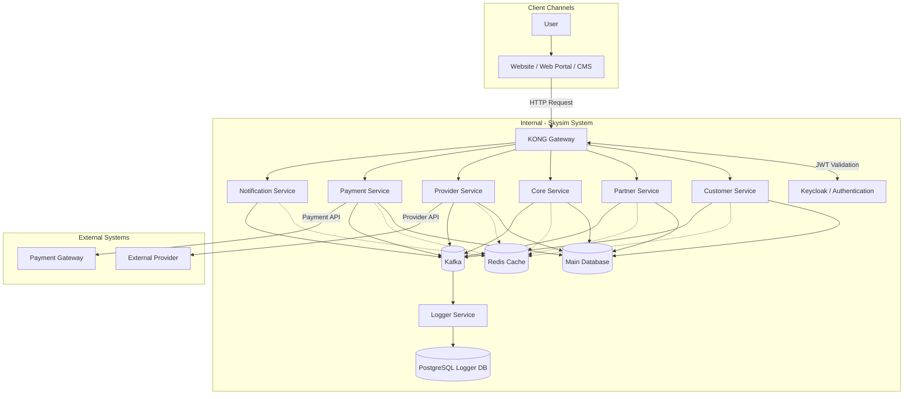
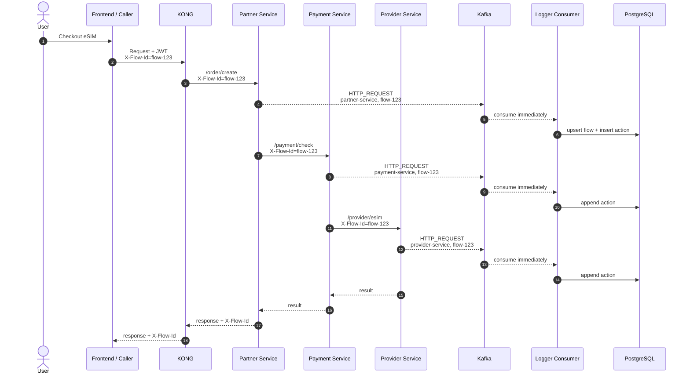
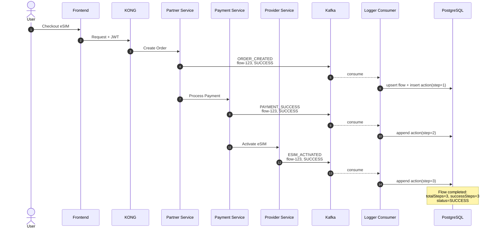

# 01 - Skysim Architecture Overview

## 1. Mục tiêu

Tài liệu này dùng để ghi chú lại kiến trúc tổng thể hệ thống Skysim trong giai đoạn Tuần 1 - Backend Foundation.

Mục tiêu chính:

- Hiểu các thành phần chính trong hệ thống Skysim.
- Hiểu request đi từ Frontend đến Backend như thế nào.
- Hiểu vai trò của API Gateway, Authentication, Backend Services, Kafka, Database, Redis.
- Xác định vị trí và vai trò của Logger Service trong kiến trúc tổng thể.

# 2. Thành phần chính của hệ thống Skysim

### 2.1 Frontend Layer

Bao gồm:

- Website B2C: phục vụ khách hàng cuối
- Web Portal B2B: phục vụ đại lý/đối tác
- CMS: phục vụ quản trị và chăm sóc khách hàng

Vai trò:

- Hiển thị dữ liệu cho người dùng
- Gửi request đến backend thông qua KONG Gateway
- Không gọi trực tiếp vào từng backend service

### 2.2 Gateway Layer

Thành phần chính:

- Cloudflare/Nginx
- KONG Gateway

Vai trò của KONG:

- Routing request đến đúng backend service
- Authentication/Authorization
- Rate limiting
- Logging/Monitoring
- Load balencing
- SSL termination
- API versioning

### 2.3 Authentication Layer

Thành phần:

- Keycloak/Authen

Vai trò:

- Quản lí đăng nhập
- Cấp và xác thực JWT
- Quản lí user, role, permission
- Hỗ trợ phân quyền truy cập API

### 2.4 Backend Microservices

Các service chính:

- Customer Service: xử lí nghiệp vụ khách hàng B2C
- Partner Service: xử lí nghiệp vụ đối tác B2B
- Core Service: xử lý đơn hàng, sản phẩm, nghiệp vụ eSIM chính
- Provider Service: giao tiếp với nhà cung cấp eSIM
- Payment Service: xử lí. thanh toán
- Notification Service: gửi email/thông báo.
- Commission Service: xử lý hoa hồng.
- Loyalty Service: xử lý khách hàng thân thiết.
- Logger Service: lưu log tập trung toàn hệ thống.

### 2.5 Infrastructure/Data Layer

Bao gồm:

- PostgreSQL/Oracle: lưu dữ liệu nghiệp vụ và log.
- Kafka: message broker/event streaming giữa các service.
- Redis: cache dữ liệu.
- Prometheus/Grafana: monitoring hệ thống.

## 3. Luồng xử lý request tổng quát

Luồng request cơ bản:


User
  ↓
Frontend Website / Portal / CMS
  ↓
KONG Gateway
  ↓
Keycloak/Authen kiểm tra JWT nếu API cần xác thực
  ↓
Backend Service tương ứng
  ↓
Database / Kafka / External Provider
  ↓
Response trả ngược lại Frontend

Giải thích:
1. Người dùng thao tác trên Website, Portal hoặc CMS
2. FE gửi request đến KONG Gateway
3. Kong kiểm tra route, auth, rate limit và chuyển request
4. Nếu API yêu cầu đăng nhập, token được xác thực thông qua Keycloak/Authen
5. BE service xử lí nghiệp vụ
6. Service có thể gọi database, gọi service khác qua REST API hoặc publish event qua Kafka
7. Response được trả về FE

## 4. REST API và Kafka trong hệ thống

### 4.1 REST API

REST API dùng cho các tác vụ cần phản hồi ngay.

Ví dụ:
- Frontend lấy danh sách package.
- Frontend tạo đơn hàng.
- Service kiểm tra trạng thái eSIM.
- Service lấy thông tin user.

Đặc điểm:
- Giao tiếp đồng bộ.
- Bên gọi thường chờ response.
- Phù hợp với nghiệp vụ realtime.

### 4.2 Kafka

Kafka dùng cho các tác vụ bất đồng bộ.

Ví dụ:
- Publish event OrderCreated.
- Publish event PaymentSuccess.
- Publish event EsimActivated.
- Gửi notification.
- Ghi audit log.
- Retry processing.

Đặc điểm:
- Giao tiếp bất đồng bộ.
- Giảm phụ thuộc trực tiếp giữa các service.
- Phù hợp với event-driven architecture.
- Có thể retry và scale consumer.


## 5. Vai trò Logger Service

Logger Service là service lưu log tập trung toàn hệ thống.

Mục tiêu:
- Thu thập log từ nhiều backend service.
- Chuẩn hóa format log.
- Lưu log vào database.
- Hỗ trợ tra cứu log theo thời gian, service, user, trạng thái.
- Hỗ trợ debug, đối soát, monitoring và điều tra sự cố.

Trong flow checkout eSIM, Logger giúp vận hành biết được:
- Đơn hàng đã được tạo chưa.
- Thanh toán đã thành công chưa.
- Provider đã được gọi chưa.
- eSIM đã kích hoạt chưa.
- Email đã gửi cho khách chưa.
- Nếu lỗi thì lỗi xảy ra ở service nào, action nào.


## 6. Sơ đồ kiến trúc tổng quan bản nháp





## 7. Luồng checkout eSIM bản nháp

```text
Customer
  ↓
Frontend Checkout Page
  ↓
KONG Gateway
  ↓
Keycloak xác thực JWT
  ↓
Order Service tạo đơn hàng
  ↓
Payment Service xử lý thanh toán
  ↓
Core Service kích hoạt eSIM (gọi Provider Service)
  ↓
Notification Service gửi email/thông báo
  ↓
Customer nhận thông tin eSIM
```

---

### 7.1 Technical HTTP Logging + Flow Propagation

**Ý chính:** LoggerMiddleware tự động capture mọi HTTP request/response và publish lên Kafka ngay lập tức. FlowId được forward qua các service.



**Rule quan trọng:**

- Nếu request đã có `X-Flow-Id`, `LoggerMiddleware` dùng lại flowId đó.
- Nếu request thiếu `X-Flow-Id`, `LoggerMiddleware` tạo flowId mới.
- `FlowContextForwardingHandler` chỉ có tác dụng khi service gọi downstream bằng đúng `HttpClient` đã gắn handler.
- Nếu một endpoint được gọi từ caller/path khác, caller đó cũng phải truyền `X-Flow-Id`, nếu không service sẽ sinh flowId riêng.

**Đặc điểm:**

- `actionType` = `HTTP_REQUEST`
- Payload: request/response (masked), duration, status, userId
- Dùng cho: debug latency, trace request path, performance monitoring

---

### 7.2 Business Event Logging + Incremental Persist

**Ý chính:** Business code publish events tại mỗi milestone. Logger Consumer consume ngay và append incremental vào cùng flow.



**Đặc điểm:**

- `actionType` = business event name: `ORDER_CREATED`, `PAYMENT_SUCCESS`, `ESIM_ACTIVATED`, ...
- Payload: request/response, status, error details (nếu failed)
- Dùng cho: business tracking, audit trail, customer support lookup

**Upsert log_flows:**

| Event status | Action |
|--------------|--------|
| SUCCESS | `successSteps++` |
| FAILED | `failedSteps++`, status → FAILED |
| Final | `completedAt`, final status |

**Không phải final step:** Logger Consumer chạy song song, không phải đợi tất cả service xong mới log.