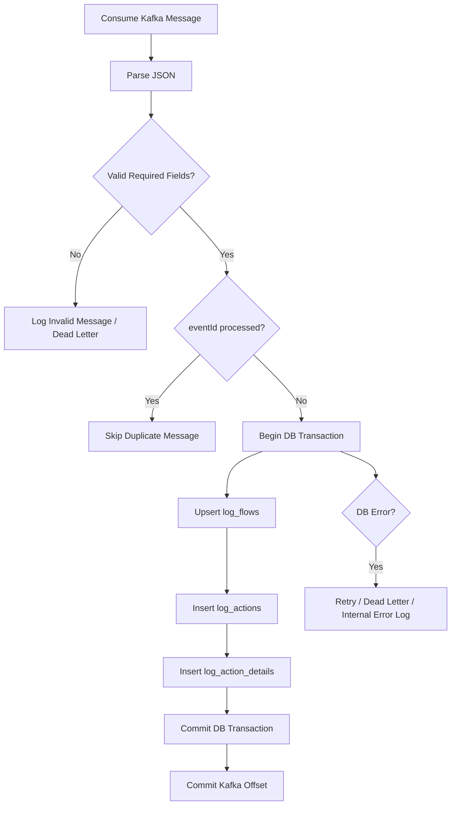

# 03 - Kafka Message Contract & Logger Consumer Design

## 1. Mục tiêu

Tài liệu này mô tả thiết kế Kafka message contract và luồng xử lý của Logger Consumer trong module Logger.

Mục tiêu chính:

- Xác định Kafka topic dùng để nhận log.
- Thiết kế format message chuẩn giữa các service và Logger.
- Xác định các field bắt buộc và không bắt buộc.
- Thiết kế luồng xử lý Kafka Consumer.
- Làm rõ cơ chế validate, retry, idempotency và commit offset.
- Chuẩn bị cơ sở để sang bước tiếp theo thiết kế database và API Logger.

---

## 2. Bối cảnh

Trong hệ thống Skysim, các backend service như Order, Payment, Core, Provider và Notification sẽ phát sinh log trong quá trình xử lý nghiệp vụ.

Thay vì để các service này gọi trực tiếp Logger API hoặc ghi trực tiếp vào database Logger, các service sẽ publish action log vào Kafka.

Logger Service sẽ đóng vai trò là Kafka Consumer:

```text
Order / Payment / Core / Provider / Notification
  ↓ publish action log
Kafka topic: skysim.action.logs
  ↓ consume
Logger Service
  ↓ save
PostgreSQL Logger DB
```

Cách thiết kế này giúp:

- Giảm coupling giữa service nghiệp vụ và Logger.
- Không làm chậm flow checkout chính.
- Hỗ trợ xử lý bất đồng bộ.
- Hỗ trợ retry khi Logger hoặc database lỗi tạm thời.
- Dễ scale consumer khi số lượng log tăng.

---

## 3. Kafka Topic Design

### 3.1 Topic chính

```text
Topic name: skysim.action.logs
```

Topic này dùng để nhận action log từ các service nghiệp vụ.

Ví dụ các service publish vào topic này:

| Service | Action |
|---|---|
| Order Service | ORDER_CREATED, ORDER_FAILED |
| Payment Service | PAYMENT_REQUESTED, PAYMENT_SUCCESS, PAYMENT_FAILED |
| Core Service / Provider Service | PROVIDER_REQUESTED, ESIM_ACTIVATED, PROVIDER_FAILED |
| Notification Service | EMAIL_SENT, EMAIL_FAILED |

---

### 3.2 Message key

```text
Message key: flowId
```

Ví dụ:

```text
CHECKOUT-20260619-000001
```

Lý do dùng `flowId` làm message key:

- Gom các action cùng một flow checkout.
- Dễ trace toàn bộ timeline của một giao dịch.
- Kafka có thể đưa các message cùng key vào cùng partition.
- Hỗ trợ giữ thứ tự tương đối của các event trong cùng một flow.

---

### 3.3 Message value

Message value dùng định dạng JSON.

```text
Message value: JSON string
```

Ví dụ:

```json
{
  "eventId": "evt-20260619-000001",
  "flowId": "CHECKOUT-20260619-000001",
  "flowType": "CHECKOUT_ESIM",
  "checkoutType": "GUEST",
  "correlationId": "corr-abc-123",

  "serviceName": "OrderService",
  "actionType": "ORDER_CREATED",
  "status": "SUCCESS",
  "stepOrder": 1,

  "customerEmail": "customer@gmail.com",
  "customerPhone": "090xxxxxxx",
  "userId": null,

  "orderId": "ORD0001",
  "paymentId": null,

  "message": "Order created successfully",

  "requestPayload": {},
  "responsePayload": {},
  "errorPayload": null,
  "metadata": {},

  "createdAt": "2026-06-19T10:00:00Z"
}
```

---

## 4. Kafka Message Contract

### 4.1 Nhóm thông tin định danh event

| Field | Type | Required | Ý nghĩa |
|---|---|---:|---|
| eventId | string | Yes | ID duy nhất của event, dùng để chống ghi trùng |
| flowId | string | Yes | ID của flow nghiệp vụ |
| flowType | string | Yes | Loại flow, ví dụ CHECKOUT_ESIM |
| checkoutType | string | No | GUEST hoặc AUTHENTICATED |
| correlationId | string | No | ID dùng để trace request kỹ thuật |

---

### 4.2 Nhóm thông tin action

| Field | Type | Required | Ý nghĩa |
|---|---|---:|---|
| serviceName | string | Yes | Service phát sinh log |
| actionType | string | Yes | Tên action nghiệp vụ |
| status | string | Yes | SUCCESS, FAILED, RUNNING |
| stepOrder | int | No | Thứ tự bước trong flow |
| message | string | No | Mô tả ngắn về action |

---

### 4.3 Nhóm thông tin customer/order/payment

| Field | Type | Required | Ý nghĩa |
|---|---|---:|---|
| customerEmail | string | No | Email khách hàng |
| customerPhone | string | No | Số điện thoại khách hàng |
| userId | string | No | ID user nếu khách đã đăng nhập |
| orderId | string | No | Mã đơn hàng |
| paymentId | string | No | Mã giao dịch thanh toán |

Ghi chú:

- `userId` không required vì Guest Checkout không có JWT.
- Với Guest Checkout, nên ưu tiên lưu `customerEmail`, `customerPhone`, `orderId` để support tra cứu.
- Với Authenticated Checkout, nên lưu cả `userId`, `customerEmail`, `customerPhone`, `orderId`, `paymentId`.

---

### 4.4 Nhóm payload chi tiết

| Field | Type | Required | Ý nghĩa |
|---|---|---:|---|
| requestPayload | object | No | Request data liên quan đến action |
| responsePayload | object | No | Response data liên quan đến action |
| errorPayload | object | No | Thông tin lỗi nếu action failed |
| metadata | object | No | Thông tin mở rộng |

Payload chi tiết có thể lớn, nên khi lưu DB nên đưa vào bảng riêng như `log_action_details`.

---

### 4.5 Nhóm thời gian

| Field | Type | Required | Ý nghĩa |
|---|---|---:|---|
| createdAt | datetime | Yes | Thời điểm event được tạo |

---

## 5. Required Fields

Các field bắt buộc cần validate:

```text
eventId
flowId
flowType
serviceName
actionType
status
createdAt
```

Nếu thiếu một trong các field này, consumer không nên lưu như log hợp lệ.

Cách xử lý message thiếu required field:

```text
1. Ghi internal error log.
2. Không insert vào bảng log chính.
3. Nếu có dead-letter topic thì đẩy message lỗi sang đó.
4. Không để consumer crash toàn bộ.
```

---

## 6. Action Type Convention

Các action chính trong checkout eSIM:

```text
ORDER_CREATED
PAYMENT_REQUESTED
PAYMENT_SUCCESS
PROVIDER_REQUESTED
ESIM_ACTIVATED
EMAIL_SENT
```

Các action lỗi:

```text
ORDER_FAILED
PAYMENT_FAILED
PROVIDER_FAILED
ESIM_ACTIVATION_FAILED
EMAIL_FAILED
```

Quy tắc đặt tên:

```text
<NOUN>_<VERB_PAST>
```

Ví dụ:

```text
ORDER_CREATED
PAYMENT_SUCCESS
ESIM_ACTIVATED
EMAIL_SENT
```

---

## 7. Status Convention

Các status đề xuất:

```text
SUCCESS
FAILED
RUNNING
```

Có thể mở rộng thêm:

```text
PENDING
TIMEOUT
PARTIAL_FAILED
```

Ý nghĩa:

| Status | Ý nghĩa |
|---|---|
| SUCCESS | Action xử lý thành công |
| FAILED | Action xử lý thất bại |
| RUNNING | Action/flow đang xử lý |
| PENDING | Đang chờ bước tiếp theo |
| TIMEOUT | Xử lý quá thời gian |
| PARTIAL_FAILED | Một phần flow lỗi nhưng nghiệp vụ chính có thể đã hoàn thành |

---

## 8. Logger Consumer Processing Flow

Luồng xử lý consumer đề xuất:

```text
1. Subscribe Kafka topic skysim.action.logs
2. Consume message
3. Parse JSON
4. Validate required fields
5. Check idempotency bằng eventId
6. Begin database transaction
7. Upsert log_flows
8. Insert log_actions
9. Insert log_action_details nếu có payload
10. Commit database transaction
11. Commit Kafka offset
12. Nếu lỗi thì retry hoặc đưa sang dead-letter topic
```

Sơ đồ xử lý:



---

## 9. Upsert log_flows Rule

`log_flows` là bảng tổng quan của flow.

Khi consumer nhận một action log:

### Nếu flowId chưa tồn tại

Tạo mới record trong `log_flows`.

Ví dụ với action đầu tiên `ORDER_CREATED`:

```text
flowId = CHECKOUT-20260619-000001
flowType = CHECKOUT_ESIM
checkoutType = GUEST
status = RUNNING hoặc SUCCESS tùy rule
lastActionType = ORDER_CREATED
lastMessage = Order created successfully
successSteps = 1
failedSteps = 0
```

### Nếu flowId đã tồn tại

Update record hiện tại:

```text
lastActionType
lastMessage
status
successSteps
failedSteps
totalSteps
updatedAt
completedAt nếu flow kết thúc
```

---

## 10. Insert log_actions Rule

Mỗi Kafka message hợp lệ tương ứng với một action log.

Insert vào `log_actions` các thông tin chính:

```text
eventId
flowId
stepOrder
serviceName
actionType
status
message
errorCode
errorMessage
createdAt
```

`eventId` cần unique để chống duplicate.

---

## 11. Insert log_action_details Rule

Nếu message có payload chi tiết thì insert vào `log_action_details`.

Payload gồm:

```text
requestPayload
responsePayload
errorPayload
metadata
```

Lý do tách payload sang bảng riêng:

- Payload có thể lớn.
- Query danh sách log không cần payload.
- Giúp bảng `log_flows` và `log_actions` nhẹ hơn.
- Chỉ load payload khi user mở chi tiết action.

---

## 12. Idempotency Design

### 12.1 Vấn đề

Kafka consumer có thể nhận trùng message trong các trường hợp:

- Consumer retry sau khi lỗi.
- Consumer xử lý DB thành công nhưng chưa kịp commit offset.
- Consumer group rebalance.
- Producer publish trùng event.

Nếu không xử lý idempotency, Logger có thể ghi trùng action.

---

### 12.2 Giải pháp đề xuất

Mỗi message cần có `eventId` duy nhất.

Trong database, tạo unique constraint:

```sql
CREATE UNIQUE INDEX ux_log_actions_event_id ON log_actions(event_id);
```

Khi consumer nhận message:

```text
1. Check eventId đã tồn tại chưa.
2. Nếu đã tồn tại: skip message và commit offset.
3. Nếu chưa tồn tại: xử lý insert bình thường.
4. Nếu insert bị lỗi duplicate key: coi như đã xử lý và không insert lại.
```

---

## 13. Commit Offset Rule

Quy tắc quan trọng:

```text
Chỉ commit Kafka offset sau khi lưu database thành công.
```

Không nên commit offset trước khi lưu DB.

Lý do:

```text
Nếu commit offset trước, sau đó DB lỗi, Kafka sẽ coi message là đã xử lý.
Kết quả: message bị mất và Logger không lưu được log.
```

Flow đúng:

```text
Consume message
→ Validate
→ Begin DB transaction
→ Save DB
→ Commit DB transaction
→ Commit Kafka offset
```

---

## 14. Retry Design

### 14.1 Lỗi tạm thời

Ví dụ:

```text
- PostgreSQL mất kết nối tạm thời
- Timeout khi save DB
- Kafka rebalance
- Network chập chờn
```

Cách xử lý:

```text
- Retry một số lần.
- Có delay giữa các lần retry.
- Không commit offset nếu chưa xử lý thành công.
```

---

### 14.2 Lỗi dữ liệu không hợp lệ

Ví dụ:

```text
- Message không phải JSON hợp lệ
- Thiếu eventId
- Thiếu flowId
- Thiếu actionType
- status không hợp lệ
```

Cách xử lý:

```text
- Ghi internal error log.
- Có thể đẩy sang dead-letter topic.
- Không để consumer crash.
```

---

### 14.3 Dead-letter topic đề xuất

```text
Topic: skysim.action.logs.dlq
```

Dùng để lưu các message không xử lý được sau nhiều lần retry hoặc message sai format.

---

## 15. Consumer Group Design

Đề xuất consumer group:

```text
Consumer group: skysim-logger-consumer-group
```

Ý nghĩa:

- Nhiều instance Logger Consumer có thể cùng thuộc một group.
- Kafka chia partition cho các consumer trong group.
- Hỗ trợ scale Logger Service khi lượng log tăng.

---

## 16. Consumer Configuration Đề Xuất

Các config cần quan tâm khi implement bằng .NET:

```text
BootstrapServers = localhost:9092
GroupId = skysim-logger-consumer-group
AutoOffsetReset = Earliest
EnableAutoCommit = false
```

Giải thích:

| Config | Ý nghĩa |
|---|---|
| BootstrapServers | Địa chỉ Kafka broker |
| GroupId | Consumer group của Logger |
| AutoOffsetReset = Earliest | Nếu chưa có offset thì đọc từ đầu topic |
| EnableAutoCommit = false | Tắt auto commit để chủ động commit sau khi lưu DB thành công |

---

## 17. Security & Sensitive Data

Không nên lưu raw toàn bộ dữ liệu nhạy cảm vào log.

Các field cần mask hoặc loại bỏ:

```text
password
access_token
refresh_token
authorization
otp
cardNumber
cvv
paymentSecret
privateKey
```

Ví dụ:

```json
{
  "authorization": "***MASKED***",
  "password": "***MASKED***"
}
```

---

## 18. Ví dụ Message Theo Từng Step

### 18.1 ORDER_CREATED

```json
{
  "eventId": "evt-order-001",
  "flowId": "CHECKOUT-20260619-000001",
  "flowType": "CHECKOUT_ESIM",
  "checkoutType": "GUEST",
  "correlationId": "corr-001",
  "serviceName": "OrderService",
  "actionType": "ORDER_CREATED",
  "status": "SUCCESS",
  "stepOrder": 1,
  "customerEmail": "guest@gmail.com",
  "customerPhone": "090xxxxxxx",
  "userId": null,
  "orderId": "ORD001",
  "paymentId": null,
  "message": "Order created successfully",
  "requestPayload": {},
  "responsePayload": {},
  "errorPayload": null,
  "metadata": {},
  "createdAt": "2026-06-19T10:00:00Z"
}
```

### 18.2 PAYMENT_SUCCESS

```json
{
  "eventId": "evt-payment-001",
  "flowId": "CHECKOUT-20260619-000001",
  "flowType": "CHECKOUT_ESIM",
  "checkoutType": "GUEST",
  "correlationId": "corr-002",
  "serviceName": "PaymentService",
  "actionType": "PAYMENT_SUCCESS",
  "status": "SUCCESS",
  "stepOrder": 3,
  "customerEmail": "guest@gmail.com",
  "customerPhone": "090xxxxxxx",
  "userId": null,
  "orderId": "ORD001",
  "paymentId": "PAY001",
  "message": "Payment completed successfully",
  "requestPayload": {},
  "responsePayload": {},
  "errorPayload": null,
  "metadata": {},
  "createdAt": "2026-06-19T10:01:00Z"
}
```

### 18.3 ESIM_ACTIVATION_FAILED

```json
{
  "eventId": "evt-esim-failed-001",
  "flowId": "CHECKOUT-20260619-000001",
  "flowType": "CHECKOUT_ESIM",
  "checkoutType": "GUEST",
  "correlationId": "corr-003",
  "serviceName": "ProviderService",
  "actionType": "ESIM_ACTIVATION_FAILED",
  "status": "FAILED",
  "stepOrder": 5,
  "customerEmail": "guest@gmail.com",
  "customerPhone": "090xxxxxxx",
  "userId": null,
  "orderId": "ORD001",
  "paymentId": "PAY001",
  "message": "Provider activation failed",
  "requestPayload": {},
  "responsePayload": null,
  "errorPayload": {
    "errorCode": "PROVIDER_TIMEOUT",
    "errorMessage": "Provider API timeout"
  },
  "metadata": {},
  "createdAt": "2026-06-19T10:02:00Z"
}
```

---

## 19. Kết luận

Kafka message contract là phần quan trọng để các service publish log thống nhất. Logger Consumer cần xử lý message theo nguyên tắc:

```text
Validate message
→ Check idempotency
→ Save DB transaction
→ Commit Kafka offset sau khi DB thành công
```

Thiết kế này giúp Logger Service:

- Không làm chậm flow nghiệp vụ chính.
- Không bị ghi trùng log.
- Hạn chế mất log khi lỗi hệ thống.
- Dễ mở rộng khi có thêm service hoặc flow nghiệp vụ mới.
